# 得账本者得天下

Hi，这里是 HelloGitHub 推出的 HelloZooKeeper 系列，**免费开源、有趣、入门级的 ZooKeeper 教程**，面向有编程基础的新手。

本系列教程是**从零开始**讲解 ZooKeeper，内容从**最基础的安装使用到背后原理和源码的讲解**，整个系列希望通过有趣文字、诙谐的气氛中让 ZK 的知识“钻”进你聪明的大脑。本教程是开放式：开源、协作，所以不管你是新手还是老司机，我们都希望你可以**加入到本教程的贡献中，一起让这个教程变得更好**：

- 新手：参与修改文中的错字、病句、拼写、排版等问题
- 使用者：参与到内容的讨论和问题解答、帮助其他人的事情
- 老司机：参与到文章的编写中，让你的名字出现在作者一栏

> 项目地址：https://github.com/HelloGitHub-Team/HelloZooKeeper

今天让我们继续深入聊一聊 ZK 的内存模型吧～

## 一、内存模型

ZKr～老规矩，今天让我们看看动物村又发生了什么事情吧？

之前的故事我们提到办事处的所有数据都是记录在小红本和小黄本中的，毕竟**马果果**是办事处的负责人，如果弄丢了，乌纱帽怕是要保不住了，所以**马果果**现在睡觉都要抱着两个账本睡觉呢。

之前**马果果**把**小F(Final)**招进来的时候，刚来的**小F(Final)**就问**马果果**：“马老师，这个账本要怎么记录啊，我怕我做不好”，**马果果**微微一笑：“别怕，既然你已经是我的入室弟子了，传内不传外，我会教你的”，“谢谢马老师！快教教我，怎么做的吧”，于是**马果果**就给**小F(Final)**上起课来...

我先拿一张之前的图：

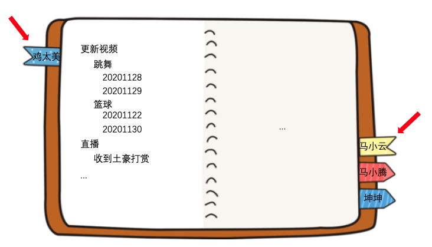

当时为了方便大家理解树形结构和 chroot，所以特地这样的画了上面这个图，实际上小红本长这样：

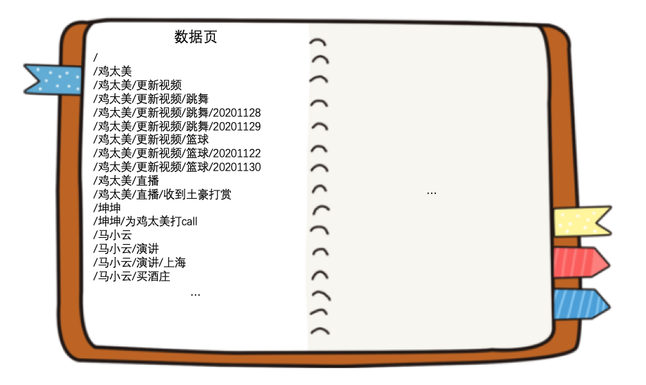

但是图中我还是把数据给省略了（因为没地画了），大家需要知道的是这样记有两个点需要注意：

- 每一个路径的父级路径必须存在，顶级的路径（例：“/鸡太美”）的父路径就是 “/” 根路径
- 路径和数据一一对应，在图中可以理解就是记在右边

但是光记录路径和数据你就太小看**马果果**了，毕竟是姜还是老的辣，**马果果**可是很高瞻远瞩的呢，我们挑一条记录放大来看看具体的细节吧

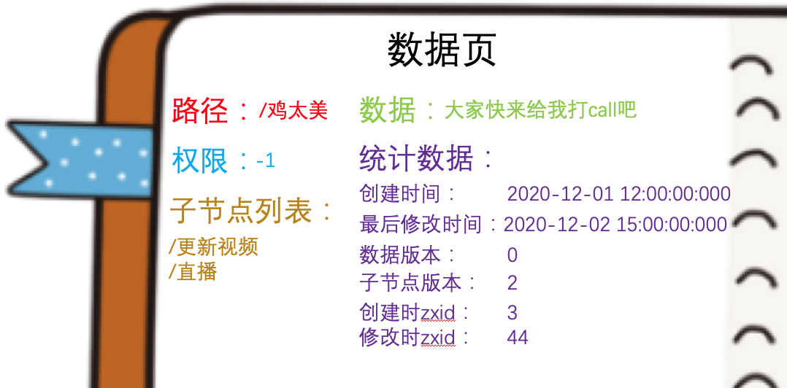

除了数据，节点上还记录着权限，统计，子节点列表。怎么样？**马果果**是不是很厉害。ZKr～

---

下面把这个内存模型用猿话翻译一下：

整个内存对象在 ZK 中对应的对象其实就是 `DataTree`

- 其实整个 ZK 的数据最终是存在一个哈希表（`ConcurrentHashMap`）中，key 是路径，而 value 则是对应的节点
- 节点包含了之前图中的：数据、子节点列表、权限、统计
- 路径、数据比较简单就不讲了
- 权限相关之后另外开篇讲，这里知道 -1 代表不进行权限校验就行
- 子节点列表，每一个节点都会维护一个子节点的列表，只记录儿子节点。孙子节点及以下都不记录
- 统计数据是给客户端查询的，统计中的数据版本会被用在删除以及更新时作为乐观锁的版本号使用

因为使用的是哈希表，所以 ZK 查询速度是很快的。而基本的那些增删改查操作，其实就是操作的这个哈希表，具体到每一个操作的流程我这里就不赘述了，因为是很简单的，只是要注意的是：

- 父路径必须存在，不存在就报错
- 当创建新路径的时候，路径和已存在的重复就报错

## 二、回调通知

上面的内容其实只说了小红本是怎么存的，但是**马果果**还有另一本核心账本：小黄本。

我们接下来一起看看小黄本，**马果果**是怎么玩的吧？

### 2.1 订阅（办事处视角）

办事处现在如火如荼的氛围，也离不开**马果果**当时定下的订阅功能，这样有需求的村民就不用一次次跑来办事处询问了。我们这次以村民们订阅大明星**鸡太美**的更新为例子讲解吧。

首先假设头号粉丝**坤坤**先跑去办事处，提出需要订阅**鸡太美**更新视频的请求，**小F(Final)**首先查看小红本必须确保 `/鸡太美/更新视频` 存在，然后掏出了小黄本，记下了：

一次订阅需要记两条记录，分别是：

- 具体事务路径对应村民
- 村民对应具体事务路径

如果有多个村民以及多个事务的话就会变成这样：

然后**坤坤**就可以安心回家等通知了。

直到**鸡太美**去办事处上传了最新的唱跳视频，**小F(Final)**在小红本中记录了：

然后**小F(Final)**就会去小黄本中查看有没有 `/鸡太美/更新视频` 的订阅，发现有三个村民：**坤坤**、**马小云**、**东东**订阅了此次事件，记住后就会把他们订阅的记录和对应的事务给删除：

然后会逐个打电话给他们，并告诉他们：

- 你们订阅的 `/鸡太美/更新视频` 有事件发生了
- 这次的事件是「数据更新」

到这里办事处负责的部分就结束了。

### 2.2 订阅（村民视角）

接下来让我们把视角切到订阅的村民，我们就拿**坤坤**举例，**坤坤**之前到办事处订阅完回家后，其实也没闲着，也拿出来一个小本本记了下来：

之后接到了办事处的电话通知，**坤坤**就会再次拿出这个小本本，根据当前办事处通知的事件 `/鸡太美/更新视频` 找到小本本中需要做的事情：拉上窗帘、打开电脑、带上耳机、准备纸巾。记住了之后，就将他们从小本本上删除了：

然后就严格按照当时记录的内容一件件去执行。

直到这里，整个从订阅到通知的流程算是结束了。因为两边都删除了记录，所以之后如果**坤坤**想要再次收到**鸡太美**更新视频的通知，需要再一次前往办事处登记一次。

但是你以为到这里就完了吗？

我们的**马果果**是一个活到老学到老的武术大师，他自从学了计算机以后，智商突飞猛进，真的是文武双全的人才啊！立马发现刚刚的流程里存在的几个问题：

1. 每次有村民过来登记订阅事务的时候，**小F(Final)**需要一个一个的记录，如果同一时间有多个村民登记的话，处于靠后位置的村民需要排队，等前面的村民登记完才能被**小F(Final)**登记在案

2. 在触发通知的时候，**小F(Final)**在小黄本中找到目标事件的订阅的之后，是一个个把要通知的村民从小黄本上删除的，并且整个删除的操作也和上一条登记的操作是冲突的，都需要排队
3. 在小黄本中记录村民登记数据的时候，一次订阅需要记两条记录，非常的占地方，能不能找个节约点的办法

经过缜密的思考后 ，**马果果**找到了优化的办法，并且准备传授给**小F(Final)**，让我们和**小F(Final)**一起跟着**马果果**学习下到底是什么办法吧～

### 2.3 小黄本的改进之路

*前排提醒：以下讲解属于进阶内容，有那么点硬核！请酌情食用*

先假设**坤坤**、**马小云**、**东东**三个人按顺序过来订阅**鸡太美**的事件 `/鸡太美`，小黄本是这样记录的：

每一个村民过来之后都会分配唯一的一个递增的编号从 0 开始，编号和村民做好互相映射关系，之后在记录下订阅路径和编号之间的关系就行。那么这么记有什么好处呢？我们先从之前**马果果**提到的第 3 点讲：

- 订阅的路径作为字符串本身的占用比较大，而且移除了原先的*村民对应具体事务路径映射关系*
- 数字本身占用比较小，而且采用了**马果果**新学的 `BitSet` 存储方式（这个呆会说），每一个村民只占用 1 个 bit 存储，理论上同一个路径订阅的村民少于 64 个的话，只需要 8 个字节就能存完

这两点都变相解决了占用内存的问题，存储问题讲完了，我们再讲讲剩下的两个问题：

- 1、现在如果村民前来登记订阅事务的话，先让**小F(Final)**查看该村民对应的编号是否存在，不存在的话需要递增当前编号并如图中一样新增编号和村民的映射关系，这个操作需要让其他村民暂时等下。但是如果该村民是已经登记过的话，直接拿着编号去路径和编号映射关系中加上这个编号即可，大致流程如下：

  

  只有分配的新的编号的时候会进行上锁，其他时候如果同时来多个订阅请求的话，使用的是读锁是可以并发的。

- 2、而触发通知的时候，只需要直接取出待通知路径对应的所有编号即可，再拿着编号去查到对应的村民一个个通知即可

     

  村委会对这次的改进很满意，**马果果**也非常高兴！此次改进只和办事处有关，村民的处理方法还是和之前是一样的。

---

故事讲（chui）完了，现在用猿话翻译一下。

### 2.4 改进前

改进前的版本中服务端使用了两个哈希表分别记录了路径和客户端的映射以及客户端和路径的映射，两个哈希表都是一对多的关系。

#### 订阅

而客户端尝试订阅某一个路径的时候，只会在请求中告诉服务端，当前这个路径需要订阅，其实就是请求中的一个布尔值。服务端获取这个请求后，得知这个路径需要订阅就会把这个客户端和路径分别存在上面提到的两个哈希表中。

然后客户端在服务端成功返回后，也会在本地做一个记录，把路径和具体要执行的回调给映射起来，所以真正的回调是放在客户端执行的，千万不要认为是服务端来远程调用客户端的代码噢！

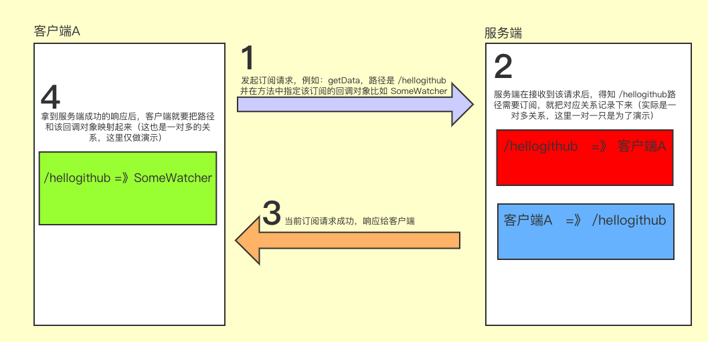

#### 触发

服务端在处理完一些事务方法后，比如：`setData`、`create`、`delete` 等，都会去检查下是否有回调通知需要触发，有的话取出需要通知的所有客户端，并逐个对他们发起通知。

客户端在收到通知后，也会从自己本地的记录中，通过路径取出具体的回调对象，然后触发该对象的回调方法。

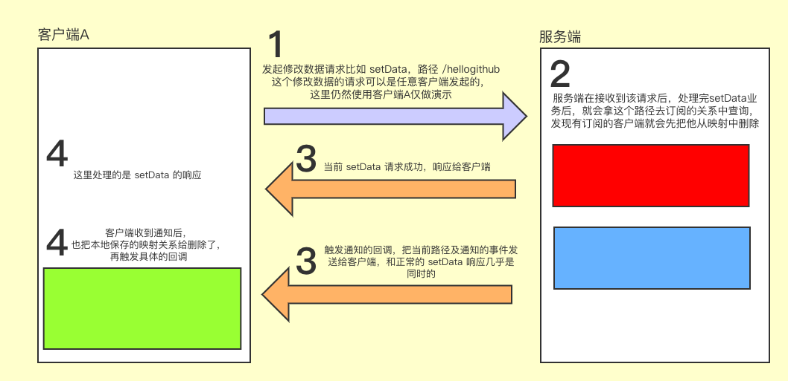

### 2.5 改进后

改进只牵涉到服务端，所以客户端的逻辑不再赘述。

而且主要的改进并不牵涉到逻辑，只牵涉到了底层的数据结构，所以我们重点来讲下这个新存储方式的数据结构 `BitSet`

*前方真高能，酌情休息下，再继续阅读*

一个 `BitSet` 底层实际是一个 `long` 类型的数组，默认初始化长度是 1，我们放大这个索引 0，看看是什么样子的吧。

这个数据类型最重要的就是 `set` 和 `get` 方法，而 ZK 服务端保证了每次往 `BitSet` 中添加的数字是递增的从 0 开始，所以我们从 0 开始逐个往其中添加数字。

0 的话就是把从右边数第一位翻成 1

然后是 1

依此类推 2 到 5 

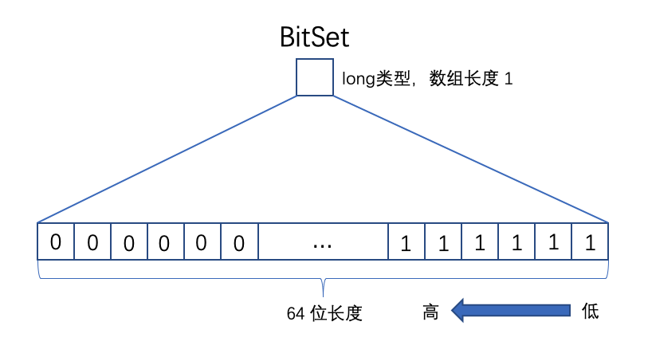

所以到这里大家能知道，`BitSet` 用一个 64 位长度的整型数字，分别用每一位的 0 或 1 来记录数据，这样长度只有 1 的数组也能记录 64 个数字，准确的说是 0 ～ 63，这 64 个数字。那么你一定会问，如果要记录 64 怎么办呢？在记录 64 的时候，数组会先扩容（通常是 2 倍）

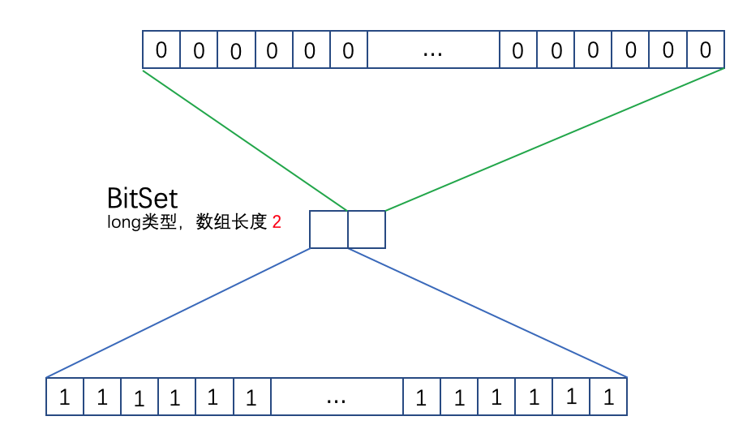

然后把索引 1 的那个数字的最右边的那一位翻成 1

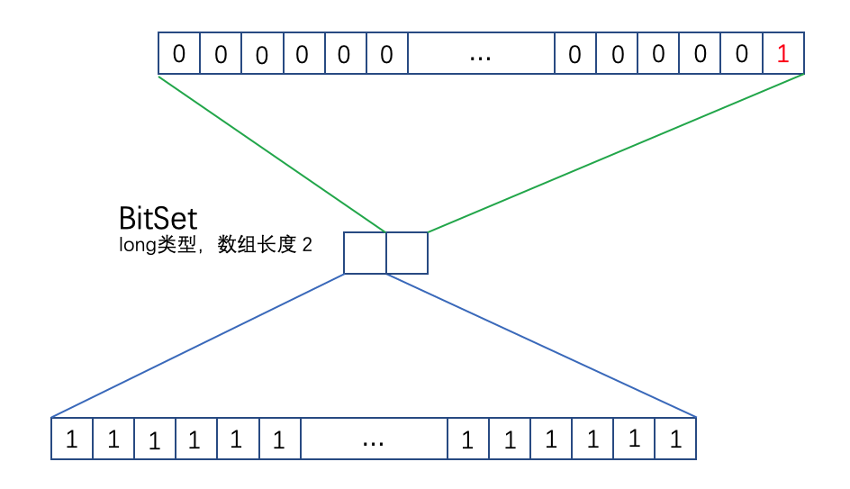

看到这里你应该能知道了为什么 `BitSet` 能存下这么多数据了吧，但是缺点也很明显，只能存大于等于 0 的数字，所以 ZK 需要使用另外两个哈希表去映射数字和客户端之间的关系。

现在再回头看这个图大家就很清楚了：

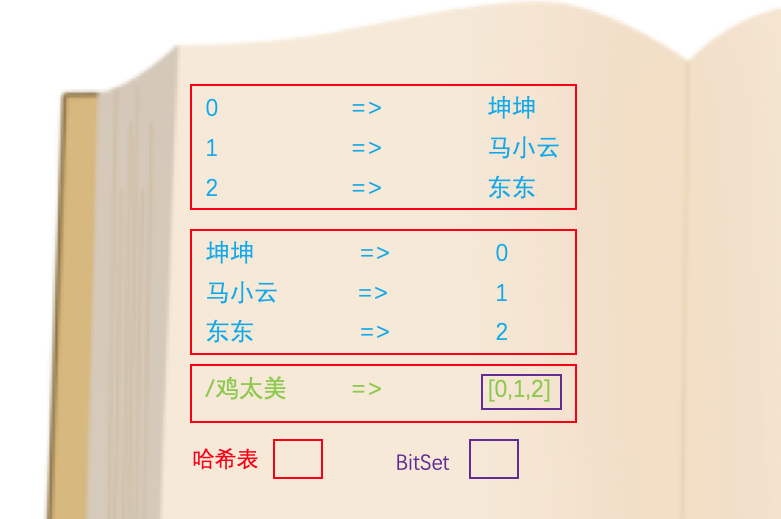

> 关于 `BitSet`这里我留一个作业给大家，ZK 为什么要维护一个从 0 开始自增的数字，如果跳着数字存，比如直接存 100、200 等等，会怎么样呢？

介绍了半天，还没讲这个改进的版本怎么用呢。很遗憾的是，ZK 默认采用的仍然是改进前的处理方法，如果要修改服务端为改进后的方法，需要在服务端的环境变量中设置 `export zookeeper.watchManagerName=org.apache.zookeeper.server.watch.WatchManagerOptimized`

讲到这里你以为本章要结束了吗？

### 2.6 一次订阅终生受益

**马果果**是一个追求极致用户体验的负责人！因为不少村民都向他抱怨过，通知后要重新过来订阅也太麻烦了，他们一般关心的事情就那些，希望能不能不用反复过来订阅，**马果果**听取了人民群众的意见，在办事处处理订阅事务时新增了一个流程，如果村民想要一次订阅终身受益，请提前告知他们，小黄本上需要多记录一些东西。假设还是**坤坤**、**马小云**过来订阅 `/鸡太美/更新视频`，`/鸡太美/跳舞` 的话：

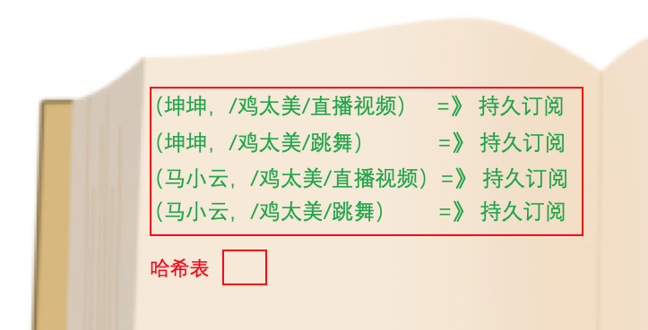

和之前不一样的是这个额外的记录是使用村民加上路径作为 key 的，然后在触发通知的时候，让**小F(Final)**额外检查下这个持久订阅的记录，如果当前村民和路径存在的话，就不删除原来的记录！这样这个订阅记录就会一直存在了，村民就不用每次通知完重新过来订阅了！村民们听后纷纷拍手叫好！**马果果**心里美滋滋，真是办了一件实事啊！

不过很快啊，**鸡太美**的头号粉丝**坤坤**又来找**马果果**了，表示自己感觉已经爱上了**鸡太美**了，想订阅和**鸡太美**有关系的所有事务，但是**鸡太美**现在是大明星了，各种事务很多很杂，如果他要去订阅**鸡太美**的每一个事务的话根本不可能，而且他也无法得知具体一共有哪些事务，所以想问**马果果**能不能再办件好事，只需要订阅**鸡太美**的顶层路径就能接受到他下面所有其他路径的通知。**马果果**不愧是见过世面的人，很快就想到了一个办法，之前新增的持久订阅的记录中，做一下区分不就行了，现在的记录变成了这样：

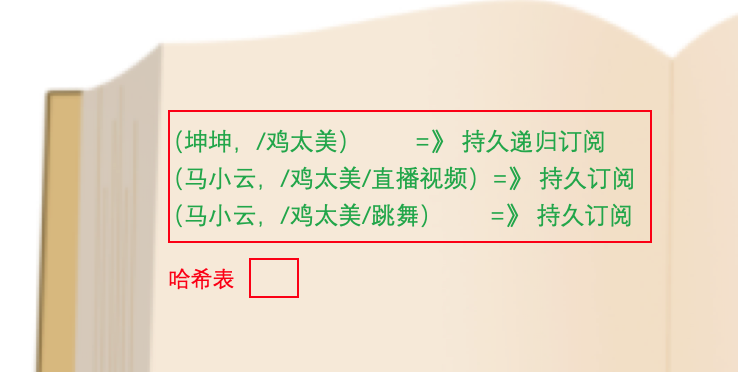

然后在通知的时候，检查到当前路径有持久递归订阅的话，就把所有当前路径的所有父级路径都检查遍是否有订阅，有的话就通知一遍，那这样，**坤坤**可以接受到所有的 `/鸡太美` 下面的所有事件通知，**坤坤**心满意足的回去了。**马果果**摇了摇头：唉，年轻人追星要理智啊！ZKr～

好了，言归正传，说说最后新加的持久订阅和持久递归订阅：

- 这两个订阅模式名字我是直接通过源码中的枚举值直译过来的：`PERSISTENT` 和 `PERSISTENT_RECURSIVE`
- 这两个订阅模式是 ZK 3.6.0 以上版本才支持的新特性
- 客户端必须通过新的接口 `addWatch` 才能添加这两类的订阅
- 删除持久的订阅也需要另外调用接口 `removeWatches`，感兴趣的同学自己花时间研究下吧
- 同一个客户端，同一个路径下只能有一种类型（共三种：一次性、持久、持久递归）的订阅，后注册的类别会覆盖之前注册的类别
- 令人遗憾的是这两个新的订阅模式和之前 2.5 提到的 `export zookeeper.watchManagerName=org.apache.zookeeper.server.watch.WatchManagerOptimized` 配置冲突，无法一起使用

## 三、总结

本章介绍了 ZK 的内存模型以及 Watcher 通知回调机制及其原理，Watcher 回调可以说是 ZK 最常用的功能了，大家在平时的业务开发中一定会经常用到，搞清楚原理也很有必要的。

下一章开始就要深入到 ZK 最核心最有特色的知识点：集群！期待一下吧！

和上一期一样，如果你有任何对文章中的疑问也可以是建议或者是对 ZK 原理部分的疑问，可以来我创建的话题中来讨论，方便记录和答疑：

> 地址：https://www.yuque.com/kaixin1002/yla8hz

最后点个赞再走吧！ZKr～

